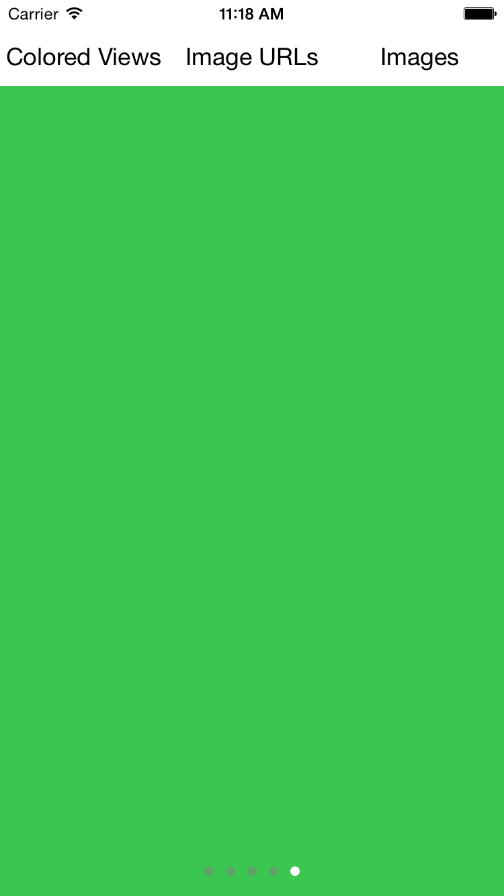

# TDPagedScrollView Looping Scroll View for iOS in Swift

This is a UI widget for showing views/images in a `UIScrollView` with
`UIPageControl` on the bottom of the scroll view. It can also be configured to
show the views/images in a head tail connected looping way, like the scroll view
at the top of the App Store.

## Setup

**Add Source (iOS 7+)**

Simply add [TDPagedScrollView.swift](./TDPagedScrollView/TDPagedScrollView.swift) file into your Xcode project.

**Carthage (iOS 8+)**

Add `github "NicholasTD07/TDPagedScrollView.swift" ~> 1.0` to your `Cartfile`
and then run `carthage update`.

## Usage

Add `import TDPagedScrollView` in your source code if you used Carthage.

`TDPagedScrollView` is a subclass of `UIView`. You can use it like any other
subclasses of `UIView`.

### Loading scroll view with subviews/images/imageURLs

You can configure `TDPagedScrollView` to load views/images by calling the
following three mehtods on an instance of `TDPagedScrollView`:

* `configureWithViews(views: [UIView], infiniteLoop: Bool = false)`
* `configureWithImages(images: [UIImage], infiniteLoop: Bool = false)`
* `configureWithImageURLs(imageURLs: [NSURL], infiniteLoop: Bool = false)`

### Customize

If there's anything that you would like to customize about the `UIScrollView`
itself or the `UIPageControl`. You can modify any property on those two views
through the public properties in `TDPagedScrollView`: `scrollView` and
`pageControl` which are instances of `UIScrollView` and `UIPageControl`,
respectively.

## Demo iOS app

This project comes with a demo app.

## License

TDPagedScrollView is licensed under the [MIT License](./LICENSE).
